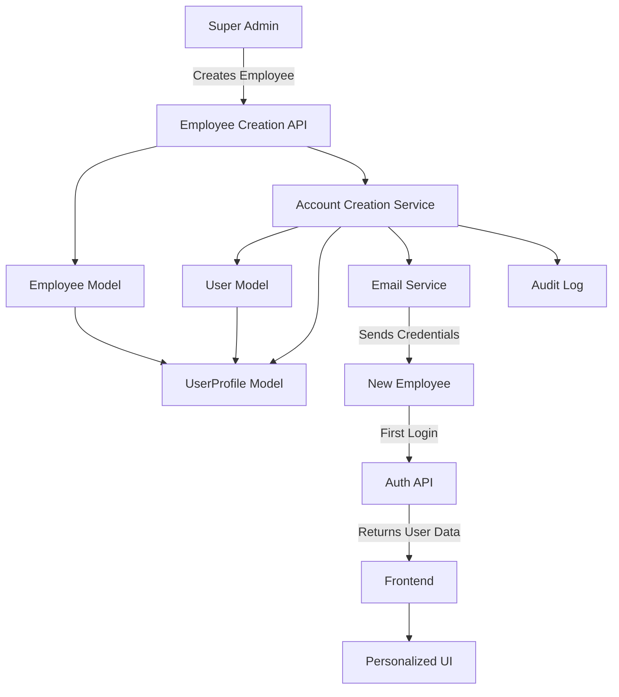

# Design Document

## Overview

This design implements automatic user account creation when a Super Admin creates a new employee record, along with personalized greetings throughout the portal. The solution integrates with the existing Django User model, UserProfile model, and Employee model to create a seamless onboarding experience.

The design focuses on:
1. Automatic user account creation during employee creation
2. Secure temporary password generation and email delivery
3. Enhanced authentication responses with employee name data
4. Frontend personalization with employee names across all pages
5. First-time login password change flow

## Architecture

### System Components



### Data Flow

1. **Employee Creation Flow**:
   - Super Admin submits employee data → Employee record created → User account auto-created → UserProfile links both → Email sent → Audit log entry

2. **Authentication Flow**:
   - User logs in → Auth validates credentials → Returns token + user data + employee name → Frontend stores in context → UI displays personalized greeting

3. **Name Display Flow**:
   - Page loads → Auth context provides employee data → Component reads firstName from context → Displays "Hi, [FirstName]"

## Components and Interfaces

### Backend Components

#### 1. Account Creation Service (`backend/authentication/services.py`)

```python
class AccountCreationService:
    """
    Service for creating user accounts automatically when employees are created.
    """
    
    @staticmethod
    def create_user_account(employee):
        """
        Create a user account for a new employee.
        
        Args:
            employee: Employee instance
            
        Returns:
            tuple: (user, temporary_password, created)
        """
        pass
    
    @staticmethod
    def generate_temporary_password():
        """Generate a secure temporary password."""
        pass
    
    @staticmethod
    def send_welcome_email(user, employee, temporary_password):
        """Send welcome email with login credentials."""
        pass
```

#### 2. Enhanced Employee Serializer

```python
class EmployeeSerializer(serializers.ModelSerializer):
    """
    Enhanced serializer with account creation support.
    """
    has_user_account = serializers.SerializerMethodField()
    username = serializers.SerializerMethodField()
    
    def create(self, validated_data):
        """Override to create user account automatically."""
        pass
```

#### 3. Enhanced Authentication Response

Update `CustomAuthToken` and `CurrentUserView` to include:
- `first_name`: Employee's first name
- `last_name`: Employee's last name
- `full_name`: Combined full name
- `employee_id`: Employee ID for reference

#### 4. Password Change Endpoint

```python
class FirstTimePasswordChangeView(APIView):
    """
    Endpoint for first-time password change.
    """
    permission_classes = [IsAuthenticated]
    
    def post(self, request):
        """Handle first-time password change."""
        pass
```

### Frontend Components

#### 1. Enhanced Auth Context (`frontend/src/contexts/PermissionContext.js`)

Add employee name fields to the context:
```javascript
const [userData, setUserData] = useState({
    firstName: '',
    lastName: '',
    fullName: '',
    employeeId: '',
    // ... existing fields
});
```

#### 2. Personalized Greeting Component (`frontend/src/components/PersonalizedGreeting.js`)

```javascript
const PersonalizedGreeting = ({ variant = 'short' }) => {
    const { userData } = usePermission();
    
    // variant: 'short' = "Hi, FirstName"
    // variant: 'full' = "Welcome Back, FirstName LastName"
    
    return (
        <div className="personalized-greeting">
            {/* Display logic */}
        </div>
    );
};
```

#### 3. First Login Password Change Page (`frontend/src/pages/FirstLoginPasswordChange.js`)

A dedicated page for users to change their temporary password on first login.

#### 4. Enhanced Sidebar Component

Update `Sidebar.js` to display personalized greeting at the top of the navigation.

## Data Models

### UserProfile Model Enhancement

The existing UserProfile model already links User and Employee:

```python
class UserProfile(models.Model):
    user = models.OneToOneField(User, on_delete=models.CASCADE, related_name='profile')
    employee = models.OneToOneField(Employee, on_delete=models.SET_NULL, null=True, blank=True, related_name='user_profile')
    # ... existing fields
    
    # Add new field for tracking first login
    password_changed = models.BooleanField(default=False)
```

### User Model Fields

Leverage Django's built-in User model fields:
- `username`: Set to employee's email
- `email`: Employee's email
- `first_name`: Employee's firstName
- `last_name`: Employee's lastName
- `password`: Hashed temporary password initially

## Error Handling

### Account Creation Errors

1. **Duplicate Email**: If email already exists as username
   - Response: 400 Bad Request
   - Message: "An account with this email already exists"
   - Action: Prevent employee creation

2. **Email Delivery Failure**: If welcome email fails to send
   - Response: 201 Created (account still created)
   - Message: "Employee created but email delivery failed. Please manually provide credentials."
   - Action: Log error, display warning to admin

3. **Role Assignment Failure**: If default Employee role doesn't exist
   - Response: 500 Internal Server Error
   - Message: "Failed to assign default role. Please contact system administrator."
   - Action: Rollback user creation

### Authentication Errors

1. **Missing Employee Link**: User exists but no employee record
   - Response: Return null for employee fields
   - Frontend: Display generic "Hi, User" greeting

2. **First Login Detection**: Check `password_changed` flag
   - If false: Redirect to password change page
   - If true: Allow normal access

## Testing Strategy

### Backend Tests

1. **Unit Tests** (`backend/authentication/tests.py`):
   - Test `AccountCreationService.create_user_account()`
   - Test temporary password generation
   - Test email sending (mocked)
   - Test UserProfile linking

2. **Integration Tests** (`backend/authentication/test_integration.py`):
   - Test employee creation with automatic account creation
   - Test authentication response includes employee name
   - Test first-time password change flow
   - Test audit logging

3. **API Tests** (`backend/employee_management/tests.py`):
   - Test POST /api/employees/ creates user account
   - Test GET /api/auth/me/ returns employee name
   - Test POST /api/auth/change-password/ for first login

### Frontend Tests

1. **Component Tests**:
   - Test PersonalizedGreeting component with different variants
   - Test greeting displays correct name from context
   - Test fallback when name is unavailable

2. **Integration Tests**:
   - Test login flow stores employee name in context
   - Test name persists across page navigation
   - Test first login redirects to password change

3. **E2E Tests**:
   - Test complete employee creation and login flow
   - Test personalized greeting appears after login
   - Test password change on first login

## Security Considerations

### Password Security

1. **Temporary Password Generation**:
   - Use `secrets` module for cryptographically secure random generation
   - Minimum 12 characters
   - Include uppercase, lowercase, digits, and special characters
   - Never log or store in plain text

2. **Password Change Enforcement**:
   - Set `password_changed = False` on account creation
   - Middleware checks flag on each request
   - Redirect to password change if false (except for password change endpoint)

3. **Email Security**:
   - Use TLS for email transmission
   - Include disclaimer about password security
   - Temporary password expires after 7 days if not changed

### Authorization

1. **Account Creation Permission**:
   - Only Super Admin and HR Manager can create employees
   - Verified through existing `IsSuperAdmin` and `IsHRManager` permissions

2. **Password Change Permission**:
   - Users can only change their own password
   - Verify user ID matches authenticated user

## Email Template

### Welcome Email Content

```
Subject: Welcome to [Organization] HRMS Portal

Dear [FirstName] [LastName],

Welcome to [Organization]! Your employee account has been created.

Employee ID: [EmployeeID]
Username: [Email]
Temporary Password: [TempPassword]

Please log in at: [Portal URL]

For security reasons, you will be required to change your password on first login.

If you have any questions, please contact HR.

Best regards,
HR Team
```

## API Endpoints

### New Endpoints

1. **POST /api/auth/first-login-password-change/**
   - Request: `{ "old_password": "temp123", "new_password": "secure456" }`
   - Response: `{ "message": "Password changed successfully" }`
   - Auth: Required (IsAuthenticated)

### Modified Endpoints

1. **POST /api/employees/**
   - Enhanced to create user account automatically
   - Response includes: `{ ..., "user_account_created": true, "username": "email@example.com" }`

2. **POST /api/auth/login/**
   - Enhanced response includes:
   ```json
   {
       "token": "...",
       "user_id": 1,
       "email": "...",
       "first_name": "Prasad",
       "last_name": "Kumar",
       "full_name": "Prasad Kumar",
       "employee_id": "EMP001",
       "requires_password_change": false,
       "roles": [...],
       "permissions": [...]
   }
   ```

3. **GET /api/auth/me/**
   - Enhanced response includes employee name fields in profile section

## Implementation Notes

### Django Signals

Use Django signals for clean separation of concerns:

```python
from django.db.models.signals import post_save
from django.dispatch import receiver

@receiver(post_save, sender=Employee)
def create_user_account_for_employee(sender, instance, created, **kwargs):
    """Automatically create user account when employee is created."""
    if created:
        AccountCreationService.create_user_account(instance)
```

### Frontend State Management

Store employee name in PermissionContext to avoid prop drilling:
- Single source of truth for user data
- Accessible from any component via `usePermission()` hook
- Persists across page navigation
- Cleared on logout

### Middleware for First Login

Create middleware to enforce password change:

```python
class FirstLoginMiddleware:
    """Redirect users who haven't changed their password."""
    
    def __init__(self, get_response):
        self.get_response = get_response
    
    def __call__(self, request):
        # Check if user needs to change password
        # Redirect if necessary
        pass
```

## Migration Strategy

### Database Migration

1. Add `password_changed` field to UserProfile model
2. Set default value to `True` for existing users
3. Set to `False` for new accounts

### Existing Employees

For employees created before this feature:
- They won't have user accounts
- Admin can manually create accounts or
- Implement a management command to bulk create accounts

```bash
python manage.py create_accounts_for_existing_employees
```

## Performance Considerations

1. **Email Sending**: Use asynchronous task queue (Celery) for email sending to avoid blocking API response
2. **Database Queries**: Use `select_related('profile__employee')` to minimize queries when fetching user data
3. **Caching**: Cache employee name in session to reduce database hits
4. **Batch Operations**: If creating multiple employees, batch email sending

## Accessibility

1. **Greeting Display**: Use semantic HTML with proper heading levels
2. **Screen Readers**: Ensure personalized greeting is announced
3. **Keyboard Navigation**: Password change form fully keyboard accessible
4. **Error Messages**: Clear, descriptive error messages for password validation
